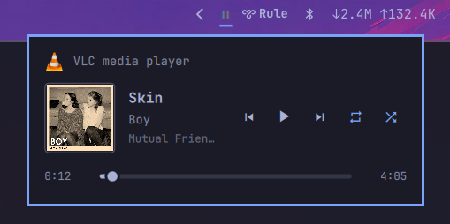

# Omarchy 媒体控制插件 (Media Control for Omarchy)

[English](README.md) | [简体中文](README.zh-CN.md)

专为 [Omarchy](https://omarchy.org) 顶部栏打造的 GNOME 风格媒体播放控制组件，支持全套 VLC 媒体播放器键盘快捷键与扩展控制功能。

当系统中有音频/视频正在播放时，顶部栏仅显示一个小巧优雅的播放/暂停图标。点击图标（或按下全局快捷键）即可滑出媒体面板，展示当前播放的应用、专辑封面、曲目名称、艺术家/专辑信息、循环与随机模式开关以及进度滑块——体验与 GNOME 快捷设置中的媒体面板一脉相承。



## 功能特性

- **轻量无干扰指示器**：仅在有媒体加载时在顶部栏显示 ▶ / ⏸ 图标，无播放时自动隐藏；支持设置暂停时隐藏。
- **GNOME 风格控制面板**：应用图标与名称、专辑封面、曲目/艺术家/专辑详情、时间进度条以及 5 个媒体控制按钮：⏮ ⏯ ⏭ 🔁 🔀。
- **循环与随机播放模式**：
  - 循环播放（Repeat）：支持三种状态轮转（关闭 / 列表循环 / 单曲循环），拥有动态状态图标与高亮指示。
  - 随机播放（Shuffle）：支持一键切换开/关，拥有高亮强调色与 Tooltip 提示。
- **全键盘控制（VLC 风格）**：采用 layer-shell 焦点捕获机制（KeyboardPanel），展开面板时直接使用 VLC 经典快捷键：空格暂停/播放、`s` 停止、`l` 循环、`r` 随机、`m` 静音、方向键快进/快退/切歌、Ctrl+方向键调节音量等。
- **进度条与时间轴**：实时显示已播时间与总时长，支持鼠标拖拽跳转（需要播放器支持进度定位并报告时长）。
- **多播放器无缝切换**：当多个播放器（如浏览器、Spotify、VLC 等）同时运行时，面板底部自动列出各媒体源，支持鼠标点击或方向键上下切换活动播放器。
- **多显示器聚焦感知**：在多屏环境下，自动在鼠标或键盘焦点当前所在的显示器上弹出面板。
- **双层 MPRIS 高兼容架构**：优先复用 Omarchy 内置的 `omarchy.media` 核心服务，若服务不可用则自动直连 DBus MPRIS 接口（`Quickshell.Services.Mpris`），无缝兼容沙箱环境。
- **原生悬停提示 (Tooltips)**：所有按钮均集成 Omarchy 原生提示框，清晰指示按钮功能或当前模式（如 `循环: 列表循环`、`随机播放: 开启`）。
- **丰富的 IPC 接口**：支持通过命令行调用或绑定自定义快捷键：`omarchy-shell debba.media-control toggle|open|close|playPause|next|previous|repeat|shuffle|stop`。
- **原生风格设计**：使用 Omarchy 原生 UI 组件构建，完全契合系统主题、强调色、栏位布局与字体。

支持所有遵循 MPRIS 标准的播放软件：Firefox、Zen、Chrome/Chromium 标签页、Spotify、mpv（搭配 `mpv-mpris`）、VLC、Rhythmbox 等。

## 环境要求

- Omarchy 4.x（基于 Quickshell 的桌面环境）

## 安装步骤

```bash
git clone https://github.com/qiongyus/omarchy-media-control ~/Projects/omarchy-media-control
~/Projects/omarchy-media-control/install.sh
```

安装脚本会自动将仓库软链接至 `~/.config/omarchy/plugins/debba.media-control`，并在顶部栏右侧启用该组件。如需放置在居中或其他区域，可传入位置参数：

```bash
~/Projects/omarchy-media-control/install.sh center
```

因为插件是通过软链接安装的，后续更新只需在仓库目录下执行 `git pull` 即可生效。

如果你的顶部栏已启用了 Omarchy 自带的 `omarchy.media` 指示器，建议将其禁用以避免两个图标重复：

```bash
omarchy plugin disable omarchy.media
```

## 使用说明

### 鼠标操作

| 操作 | 效果 |
|------|------|
| 左键单击顶部栏图标 | 展开 / 收起媒体面板 |
| 右键单击顶部栏图标 | 播放 / 暂停 |
| 中键单击顶部栏图标 | 下一曲 |
| 滚轮上下滚动图标 | 上一曲 / 下一曲 |
| 单击面板循环按钮 | 轮转循环模式（关闭 → 列表循环 → 单曲循环） |
| 单击面板随机按钮 | 切换随机播放（开 / 关） |
| 拖拽进度滑块 | 跳转播放进度（需播放器支持 Seek） |
| 单击列表中的媒体源 | 切换至该播放源 |

### 键盘快捷键（面板处于打开聚焦状态时）

与 VLC 媒体播放器官方快捷键保持一致：

| 按键 | 对应动作 |
|------|----------|
| `Space` / `Enter` | 播放 / 暂停 |
| `s` | 停止播放 |
| `n` / `→` (方向右) | 下一曲 |
| `p` / `←` (方向左) | 上一曲 |
| `l` | 轮转循环播放（关闭 → 列表循环 → 单曲循环） |
| `r` | 切换随机播放模式（开 / 关） |
| `m` | 静音 / 取消静音 |
| `Ctrl + ↑` / `Ctrl + ↓` | 增大 / 减小音量（每次 ±5%） |
| `Shift + ←` / `Shift + →` | 微调快退 / 快进 3 秒 |
| `Alt + ←` / `Alt + →` | 短程快退 / 快进 10 秒 |
| `Ctrl + ←` / `Ctrl + →` | 中程快退 / 快进 60 秒 |
| `↑` / `↓` | 切换活动播放源（存在多个媒体源时） |
| `Esc` / `Ctrl + Q` | 关闭媒体面板 |

### 全局呼出快捷键

可在 `~/.config/hypr/bindings.lua` 中配置全局唤起快捷键：

```lua
o.bind("SUPER + M", "Media panel", "omarchy-shell debba.media-control toggle")
```

### IPC 命令行接口

可通过终端、脚本或自定义快捷键直接调用 IPC 命令控制媒体：

```bash
# 展开 / 收起 / 打开 / 关闭面板
omarchy-shell debba.media-control toggle
omarchy-shell debba.media-control open
omarchy-shell debba.media-control close

# 播放控制
omarchy-shell debba.media-control playPause   # 播放/暂停
omarchy-shell debba.media-control next        # 下一曲
omarchy-shell debba.media-control previous    # 上一曲
omarchy-shell debba.media-control stop        # 停止

# 模式切换
omarchy-shell debba.media-control repeat      # 轮转循环模式
omarchy-shell debba.media-control shuffle     # 切换随机模式
```

## 设置项 (Settings)

可通过 `omarchy bar set` 命令行修改，或直接编辑 `~/.config/omarchy/shell.json`：

```bash
omarchy bar set debba.media-control hideWhenPaused true
omarchy bar set debba.media-control panelWidth 380
```

| 参数名 | 类型 | 默认值 | 说明 |
|--------|------|--------|------|
| `hideWhenPaused` | boolean | `false` | 暂停播放时是否隐藏顶部栏图标（面板展开期间保持显示） |
| `panelWidth`     | number  | `360`   | 展开面板的像素宽度（默认 360px） |

## 卸载

```bash
~/Projects/omarchy-media-control/uninstall.sh
```

## 注意事项

- 部分网页浏览器仅在特定网站（如 YouTube、SoundCloud）提供完整的媒体时长信息，因此进度条可能不会在所有网页标签中出现。
- `mpv-mpris` 插件会为单个 mpv 实例注册两个 DBus 接口名称，因此 mpv 在媒体源列表中可能显示两次，此为 mpv 插件特性。

## 致谢与开源协议

本项目 Fork 并增强自 Andrea Debernardi 的开源项目 [debba/omarchy-media-control](https://github.com/debba/omarchy-media-control)。

遵循 MIT 开源协议 — 详情参见 [LICENSE](LICENSE)。
